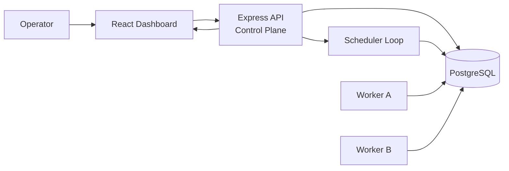
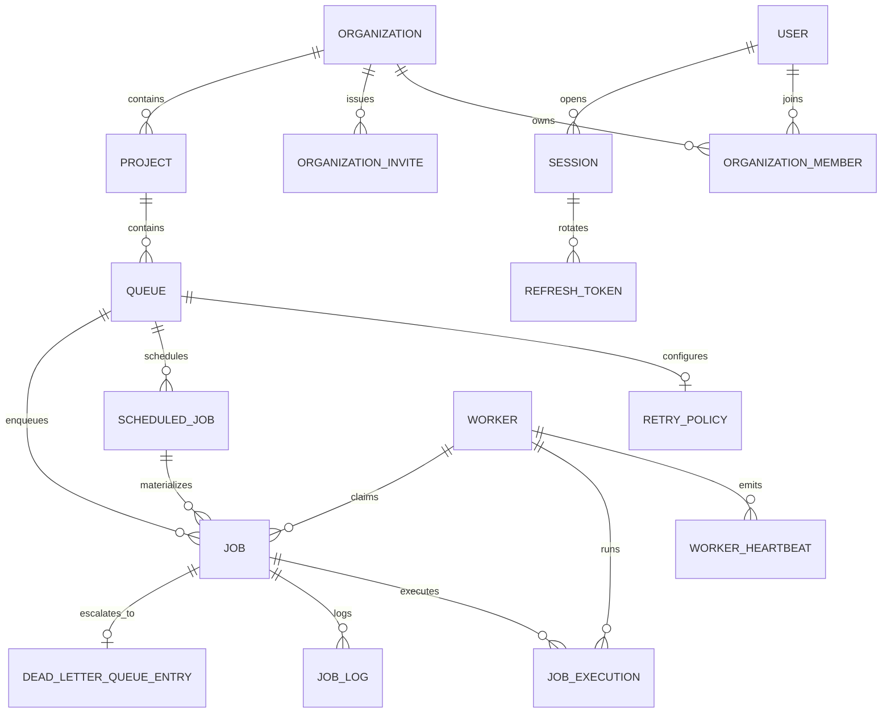
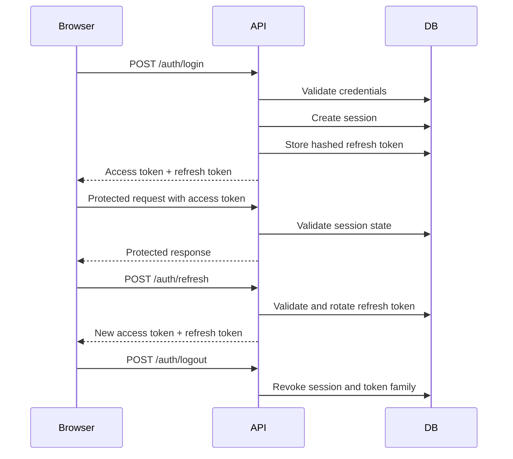
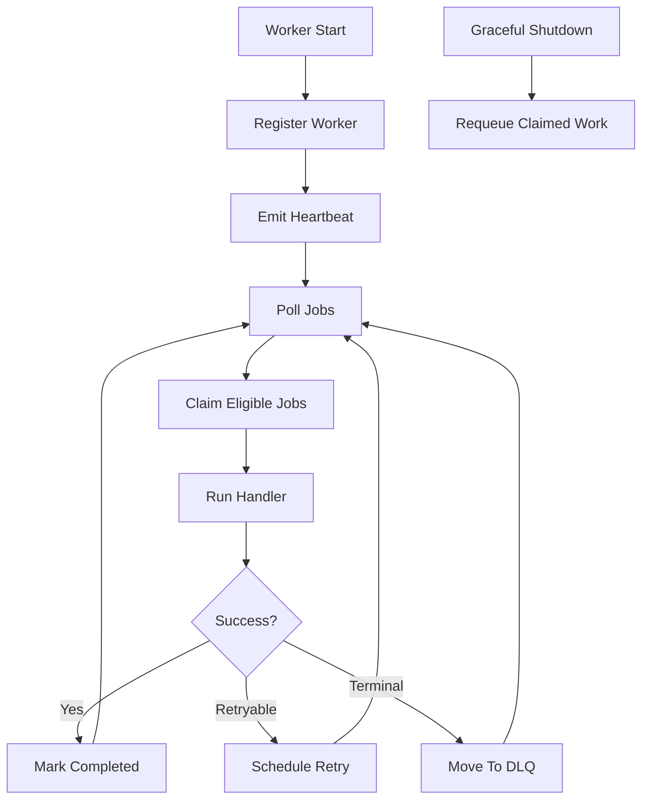
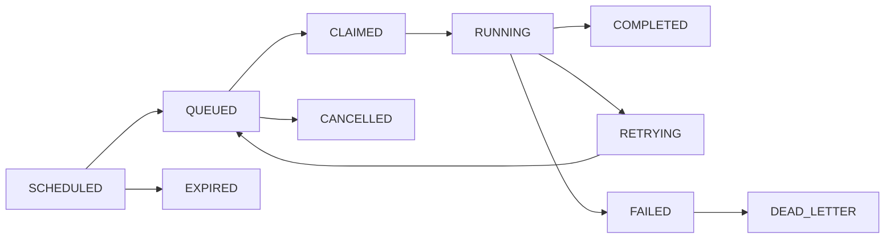
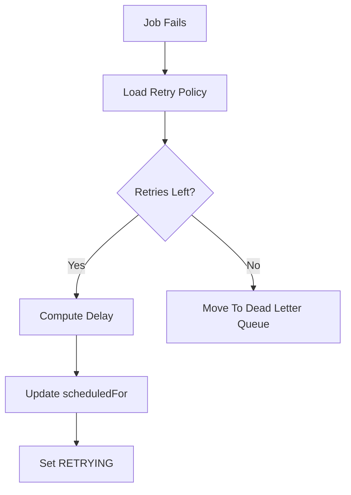

# DISTRIBUTED JOB SCHEDULER

## Project Report

**Student Name:** Naman Mahajan  
**Registration Number:** RA2311003011711  
**Project Title:** Distributed Job Scheduler  
**Repository:** https://github.com/namanmahajan2020/Distributed-Job-Scheduler  
**Academic Submission Type:** Software Engineering Project Report  

---

## Certificate Page

This is to certify that the project report titled **Distributed Job Scheduler** has been prepared by **Naman Mahajan (RA2311003011711)** as part of the academic submission requirements. The work presented in this document describes the analysis, design, implementation, testing, and documentation of a production-inspired distributed background job scheduling platform developed using modern full-stack technologies and backend engineering practices.

This report reflects an engineering-oriented approach to solving asynchronous workload orchestration problems, including concurrency handling, worker coordination, retry policies, dead-letter queue management, operational monitoring, and secure administrative control.

---

## Acknowledgement

I would like to express my sincere gratitude to everyone whose work, guidance, and resources contributed to the successful completion of this project. I am especially thankful for the assignment framework that encouraged the development of a system beyond a simple CRUD application and pushed the work toward distributed systems thinking, production-quality backend design, and operational maturity.

I would also like to acknowledge the broader open-source ecosystem that made this project possible. Technologies such as **Node.js**, **Express**, **PostgreSQL**, **Prisma**, **React**, **Socket.IO**, **Jest**, and **Docker** provide the foundations upon which modern software systems are built. Their documentation, community support, and engineering standards served as an important reference throughout the project lifecycle.

Finally, I acknowledge the value of software engineering best practices such as validation, observability, documentation, modular design, testing, and deployment discipline. These practices significantly shaped the final form of this submission and helped transform the repository into a production-inspired system suitable for evaluation in an internship or software engineering interview context.

---

## Abstract

Modern software products depend heavily on asynchronous background processing for workflows such as notifications, reconciliation, reporting, imports, integrations, and event-driven automation. While such tasks appear conceptually simple, reliable execution at scale introduces important engineering challenges. These include durable job persistence, concurrent worker coordination, prevention of duplicate execution, retry management, stale worker detection, dead-letter isolation, observability, secure administration, and operational control.

The **Distributed Job Scheduler** project addresses these challenges by implementing a full-stack, production-inspired platform for scheduling and executing background jobs across multiple workers. The system is built as a TypeScript monorepo containing an **Express API**, a **PostgreSQL database accessed through Prisma**, a **worker runtime**, and a **React-based operations dashboard**. The architecture separates the control plane from the execution plane while using PostgreSQL as the durable source of truth for job state, queue configuration, retry logic, worker heartbeats, authentication sessions, and audit logs.

The project supports **immediate**, **delayed**, **scheduled**, **recurring**, and **batch** jobs. It includes queue-level concurrency settings, retry strategies with fixed, linear, and exponential backoff, dead-letter queue behavior, JWT authentication with refresh token rotation, role-based access control, real-time updates through Socket.IO, structured logging, OpenAPI documentation, and automated tests with strong coverage over the backend surface.

This report presents the motivation, requirements, architecture, database model, execution lifecycle, implementation decisions, testing strategy, deployment design, performance considerations, and future enhancement opportunities for the system. The completed implementation demonstrates a realistic understanding of distributed background processing and reflects engineering decisions aligned with production-quality backend systems.

---

## Table Of Contents

1. Introduction  
2. Problem Statement  
3. Objectives  
4. Scope Of The Project  
5. Existing System Analysis  
6. Proposed System Overview  
7. Functional Requirements  
8. Non-Functional Requirements  
9. Technology Stack  
10. System Architecture  
11. High Level Design  
12. Low Level Design  
13. Database Design  
14. ER Diagram  
15. API Design  
16. Authentication Flow  
17. Queue Management  
18. Worker Architecture  
19. Job Types  
20. Job Lifecycle  
21. Retry Strategies  
22. Dead Letter Queue  
23. Scheduler Design  
24. Dashboard Design  
25. Real-Time Updates  
26. Security Features  
27. Logging And Monitoring  
28. Error Handling  
29. Testing Strategy  
30. Coverage Summary  
31. Docker Deployment  
32. Performance Optimizations  
33. Scalability Considerations  
34. Design Decisions  
35. Challenges Faced  
36. Assignment Compliance Summary  
37. Future Enhancements  
38. Conclusion  
39. References  
40. GitHub Repository Link  

---

## 1. Introduction

As software systems evolve, they increasingly rely on asynchronous job execution to separate user-facing request latency from backend processing complexity. Many important workflows should not block the main application response cycle. For example, when a payment is created, the system may also need to notify downstream services, reconcile state, generate ledger entries, dispatch webhooks, update analytics, send emails, and archive audit logs. Performing these tasks synchronously leads to poor user experience and reduced system resilience.

A distributed job scheduler solves this problem by moving background work into durable queues processed by workers. However, once work becomes distributed, the engineering complexity increases significantly. Multiple workers may compete for the same job. A worker may crash while running a task. Retries may need to respect timing policies and limits. Some failures should be retried automatically while others should be isolated into a dead-letter queue. Operators need visibility into queue health, worker health, execution outcomes, and performance trends.

This project was designed to address these real-world concerns. Rather than creating a basic task list or a traditional CRUD application, the system models the behavior of a small but meaningful distributed background processing platform. The result is a project that demonstrates backend architecture, reliability engineering, operational observability, security practices, documentation quality, and production-oriented thinking.

---

## 2. Problem Statement

The central problem addressed by this project is:

> How can a software system reliably schedule, execute, monitor, and control asynchronous background jobs across multiple workers while preserving durability, preventing duplicate execution, handling failures intelligently, and providing operational visibility?

This problem includes several sub-problems:

- ensuring job state is persisted durably
- coordinating multiple workers safely
- preventing duplicate execution under contention
- supporting multiple scheduling modes
- recovering from worker failure
- implementing retry policies with bounded behavior
- providing administrative control over queues and jobs
- exposing useful metrics and logs
- securing the platform with authentication and authorization

The Distributed Job Scheduler solves these issues by combining a durable relational data model, explicit state transitions, worker heartbeats, queue configuration, and a live operator dashboard.

---

## 3. Objectives

The main objectives of the project are:

- design and implement a distributed job scheduling system with production-inspired architecture
- support multiple job types: immediate, delayed, scheduled, recurring, and batch
- ensure job execution is reliable and fault-tolerant
- use PostgreSQL as a durable coordination and storage layer
- provide secure access using JWT, refresh tokens, and role-based authorization
- expose REST APIs with validation and documentation
- create a dashboard for queue, job, and worker operations
- record logs, metrics, and execution history
- test the backend thoroughly and document the solution professionally

---

## 4. Scope Of The Project

The scope of this implementation includes:

- API layer for authentication, organizations, projects, queues, jobs, metrics, and workers
- worker layer for polling, atomic claims, execution, heartbeat emission, retry transitions, and graceful shutdown
- persistence model for queues, jobs, executions, logs, sessions, workers, retry policies, and recurring schedules
- dashboard for authenticated operations and live monitoring
- operational documentation through diagrams, README material, and this report

The scope is intentionally focused on a realistic assignment-sized platform rather than a fully commercial scheduler with distributed message brokers, external event buses, or multi-region failover. Even so, the implementation reflects the design patterns and tradeoffs found in real-world background execution systems.

---

## 5. Existing System Analysis

Before designing the proposed system, it is useful to evaluate the limitations of typical basic task runners and simplistic queue approaches.

### 5.1 Common Existing Approaches

- in-memory queues inside the application server
- ad hoc cron scripts without centralized visibility
- one-off worker scripts using direct database polling without lifecycle modeling
- simplistic task tables without retries, heartbeats, or audit trails

### 5.2 Limitations Of Existing Approaches

- jobs disappear when the process restarts
- no durable scheduling or retry history
- no protection against multiple workers claiming the same task
- no queue-level concurrency or rate policies
- no real administrative controls
- poor auditability and debugging experience
- no secure multi-tenant access model
- no live operational dashboard

### 5.3 Need For A Better System

The analysis of existing approaches shows the need for a platform that treats background work as a first-class operational system. Such a platform should preserve correctness, maintain visibility, and support change safely over time.

---

## 6. Proposed System Overview

The proposed system is a distributed scheduler with a clear separation between control-plane responsibilities and execution responsibilities.

### 6.1 Control Plane

The control plane is implemented in the API service. It is responsible for:

- authentication and session management
- role-based authorization
- organization and project ownership
- queue creation and lifecycle control
- job creation and inspection
- recurring schedule orchestration
- metrics generation
- OpenAPI exposure
- real-time operator updates

### 6.2 Execution Plane

The execution plane is implemented as a dedicated worker process. It is responsible for:

- heartbeats
- atomic job claims
- job execution
- execution logging
- retry scheduling
- DLQ transition
- graceful shutdown behavior

### 6.3 Persistence Layer

PostgreSQL, accessed through Prisma ORM, stores:

- users and memberships
- projects and queues
- jobs and job executions
- recurring schedules
- retry policies
- worker status and heartbeats
- sessions and refresh tokens
- logs and DLQ records

This ensures that the scheduler is durable, queryable, and auditable.

---

## 7. Functional Requirements

The implemented system satisfies the following functional requirements:

### 7.1 Authentication

- register user
- login user
- refresh token rotation
- logout
- current-user lookup

### 7.2 Organization And Project Management

- create organization
- invite members
- manage projects under organizations
- role-aware access boundaries

### 7.3 Queue Management

- create queue
- update queue
- pause queue
- resume queue
- archive queue
- view queue statistics

### 7.4 Job Management

- create immediate job
- create delayed job
- create scheduled job
- create recurring job definition
- create batch jobs
- list jobs with pagination and filters
- cancel jobs
- retry jobs from DLQ
- inspect job logs

### 7.5 Worker Management

- register workers
- send heartbeats
- mark stale workers
- view worker health

### 7.6 Dashboard Operations

- view metrics
- view queue state
- view worker state
- view jobs
- perform retry, pause, resume, and cancel actions

---

## 8. Non-Functional Requirements

The system also addresses key non-functional requirements:

### 8.1 Reliability

Job state is stored durably in PostgreSQL. Worker claims are atomic. Retry and DLQ behavior are explicit.

### 8.2 Scalability

Workers are isolated from the API and can scale independently. Queue configuration isolates workload behavior.

### 8.3 Maintainability

The codebase is modular and documented. Validation, middleware, services, and UI responsibilities are clearly separated.

### 8.4 Security

JWT access tokens, refresh token rotation, bcrypt hashing, CORS, rate limiting, and RBAC are implemented.

### 8.5 Observability

Structured logging, job logs, metrics, and live updates improve operational visibility.

### 8.6 Testability

The backend includes Jest and Supertest coverage with a strong verification focus over the configured API surface.

---

## 9. Technology Stack

| Layer | Technology | Purpose |
| --- | --- | --- |
| Frontend | React, TypeScript, Vite | Dashboard UI |
| Styling | Tailwind CSS | Responsive interface |
| API | Node.js, Express, TypeScript | Control plane |
| Database | PostgreSQL | Durable storage and coordination |
| ORM | Prisma | Schema management and database access |
| Auth | JWT, Refresh Tokens, bcrypt | Security and session management |
| Validation | Zod | Input validation |
| Logging | Pino | Structured logs |
| Realtime | Socket.IO | Live operational updates |
| Scheduling | node-cron | Recurring and maintenance loops |
| Testing | Jest, Supertest | Backend verification |
| Containerization | Docker, Docker Compose | Local deployment |

---

## 10. System Architecture

### 10.1 Architectural Interpretation

This architecture intentionally avoids embedding job execution inside the API service. By doing so, the project achieves cleaner separation of concerns:

- the API remains focused on orchestration and administration
- workers remain focused on execution
- PostgreSQL becomes the durable synchronization boundary

This design also simplifies crash recovery because the persisted job state does not depend on any in-memory queue state.

---

## 11. High Level Design

The system can be understood through four major subsystems:

### 11.1 Identity And Access Subsystem

Responsible for user registration, login, refresh token rotation, session persistence, and role-aware route protection.

### 11.2 Queue And Scheduling Subsystem

Responsible for queue configuration, recurring schedules, job creation, scheduling, retry calculation, and DLQ transitions.

### 11.3 Worker Execution Subsystem

Responsible for worker registration, polling, atomic claiming, execution, logging, and graceful shutdown.

### 11.4 Operator Visibility Subsystem

Responsible for metrics aggregation, Socket.IO snapshots, queue and worker dashboards, and logs inspection.

---

## 12. Low Level Design

### 12.1 API Internals

The API is organized around:

- `config.ts` for configuration validation
- `middlewares.ts` for request context, auth, RBAC, and error handling
- `routes.ts` for HTTP route definitions
- `services.ts` for business logic
- `openapi.ts` for API documentation
- `realtime.ts` for Socket.IO events
- `scheduler.ts` for maintenance loops

### 12.2 Worker Internals

The worker runtime includes:

- configuration parsing
- worker registration
- heartbeat scheduling
- SQL claim path
- execution wrapper with timeout
- retry handling
- DLQ transition
- graceful shutdown coordination

### 12.3 Shared Validation

The shared package centralizes schemas for:

- auth payloads
- queue creation and updates
- job creation
- recurring job creation
- batch job creation
- pagination and filtering

This improves consistency and reduces duplication across the system.

---

## 13. Database Design

The database schema is designed for durability, auditability, and operational reporting.

### 13.1 Major Entities

- `User`
- `Organization`
- `OrganizationMember`
- `OrganizationInvite`
- `Project`
- `Queue`
- `RetryPolicy`
- `ScheduledJob`
- `Job`
- `JobExecution`
- `Worker`
- `WorkerHeartbeat`
- `JobLog`
- `DeadLetterQueueEntry`
- `Session`
- `RefreshToken`

### 13.2 Important Constraints

- unique user emails
- unique organization slug
- unique project slug within an organization
- unique queue slug within a project
- unique deduplication key inside a queue
- unique token hash for refresh token persistence
- unique DLQ entry per job

### 13.3 Important Indexes

Indexes were added around:

- queue status and ownership filters
- job lifecycle lookups
- scheduled time promotion
- worker heartbeat visibility
- session and refresh token validation paths
- job logs and execution queries

### 13.4 Why A Relational Model Works Well

A relational database is a strong fit because:

- job state is naturally structured
- auditing is important
- queue ownership relationships matter
- worker state needs durable coordination
- transactional updates are essential for correctness

---

## 14. ER Diagram

### 14.1 ER Interpretation

The ER design reflects the core story of the platform:

- users belong to organizations through memberships
- organizations own projects
- projects own queues
- queues own jobs and recurring schedules
- jobs produce executions, logs, and optional DLQ entries
- workers claim and execute jobs
- sessions and refresh tokens secure authenticated access

---

## 15. API Design

The API is REST-oriented and organized around domain resources.

### 15.1 Endpoint Groups

- authentication
- organizations
- projects
- queues
- jobs
- recurring jobs
- workers
- metrics

### 15.2 API Characteristics

- JSON-based
- validated inputs
- paginated list responses
- structured error responses
- protected routes where required
- documented through OpenAPI and Swagger UI

### 15.3 API Consistency

Consistency is maintained through:

- shared validation schemas
- request context middleware
- central error normalization
- service-layer business logic
- uniform auth behavior

---

## 16. Authentication Flow

### 16.1 Why Session-Aware JWT Works Here

Purely stateless JWT systems make logout harder because tokens remain valid until expiry. This implementation combines the convenience of JWT bearer tokens with database-backed sessions and refresh token rotation. That makes logout, revocation, and rotation much safer.

---

## 17. Queue Management

Queues are core workload control units in the platform.

### 17.1 Queue Capabilities

- concurrency limits
- max worker budget
- rate limit per minute
- retry policy definition
- pause and resume
- archival lifecycle
- queue metrics

### 17.2 Why Queue-Level Controls Matter

Different workloads behave differently. For example:

- webhook delivery may tolerate retries but need lower concurrency
- reconciliation may allow long timeouts and high priority
- exports may run as batch workloads with looser urgency

Queue configuration allows these concerns to be expressed operationally without rewriting execution code.

---

## 18. Worker Architecture

The worker service is a dedicated runtime responsible for execution correctness.

### 18.1 Worker Responsibilities

- register with the database
- emit heartbeats
- poll eligible jobs
- claim jobs atomically
- execute handlers
- persist results
- schedule retries
- move terminal failures to DLQ
- requeue claimed work on shutdown

### 18.2 Worker Flow

### 18.3 Why Separate Workers

Keeping workers separate from the API avoids:

- request handling interference
- accidental memory contention
- lifecycle coupling between admin traffic and execution traffic

It also makes scale-out simpler.

---

## 19. Job Types

The system supports all major job categories required in the assignment.

### 19.1 Immediate Jobs

These are enqueued directly in `QUEUED` state and become eligible for worker claims immediately.

### 19.2 Delayed Jobs

These use either an explicit scheduled time or a derived time based on delay seconds. They remain in `SCHEDULED` state until due.

### 19.3 Scheduled Jobs

These are intended for one-time execution at a future timestamp and move to `QUEUED` when the scheduler loop promotes them.

### 19.4 Recurring Jobs

Recurring schedules are stored separately and periodically materialize new runtime jobs according to cron expressions.

### 19.5 Batch Jobs

Batch jobs create multiple job rows under a shared `batchKey`. This enables grouped ingestion while preserving individual execution and retry semantics per item.

---

## 20. Job Lifecycle

### 20.1 Lifecycle Importance

The explicit lifecycle is central to observability and correctness. Operators need to know:

- what is waiting
- what is running
- what failed
- what will retry
- what needs intervention

The schema and service layer model these states directly instead of treating execution as an opaque background side effect.

---

## 21. Retry Strategies

The retry subsystem is one of the most important reliability features in the platform.

### 21.1 Supported Strategies

- fixed delay
- linear backoff
- exponential backoff

### 21.2 Retry Inputs

Retry behavior depends on:

- queue policy
- per-job max retry count
- retry-on-timeout behavior
- current retry count

### 21.3 Retry Flow

### 21.4 Why Retries Must Be Bounded

Unbounded retries can hide systemic failures and consume resources indefinitely. Bounded, observable retries are safer and easier to operate.

---

## 22. Dead Letter Queue

The dead-letter queue isolates jobs that are no longer eligible for automatic retries.

### 22.1 Purpose Of DLQ

- preserve failed jobs for inspection
- avoid infinite retry loops
- separate transient errors from persistent errors
- enable manual intervention

### 22.2 DLQ Behavior In This System

When a retry limit is exceeded:

- job status becomes `DEAD_LETTER`
- a `DeadLetterQueueEntry` row is created or updated
- the failure reason is retained
- operators can retry the job later through the API or dashboard

---

## 23. Scheduler Design

The scheduler loop is implemented in the API service using cron-based tasks.

### 23.1 Scheduled Responsibilities

- promote due scheduled jobs
- promote due retrying jobs
- trigger recurring schedules
- mark stale workers
- recover stale claims
- broadcast snapshot metrics

### 23.2 Why The Scheduler Lives In The Control Plane

The control plane already owns orchestration state and route-driven administration. Housing the scheduler there keeps policy changes close to the main business logic and avoids introducing another service before it becomes necessary.

---

## 24. Dashboard Design

The dashboard is designed as an operations console rather than a static reporting UI.

### 24.1 Dashboard Pages

- login page
- overview page
- queues page
- jobs page
- workers page

### 24.2 Dashboard Features

- JWT-backed login flow
- live metrics
- queue pause and resume actions
- job retry and cancel actions
- worker heartbeat visibility
- filtered API-driven views

### 24.3 UX Direction

The visual design uses a dark operational aesthetic with:

- card-based metrics
- highlighted queue actions
- charts for throughput
- compact worker health summaries

---

## 25. Real-Time Updates

Socket.IO is used to provide timely operational visibility.

### 25.1 Realtime Event Categories

- `queue:update`
- `job:update`
- `worker:update`
- `log:create`
- `metrics:update`
- `snapshot:update`

### 25.2 Why Realtime Matters

In operational systems, dashboards that rely entirely on manual refresh are less useful. Realtime event emission helps operators understand:

- when workers go stale
- when queues are paused or resumed
- when jobs fail
- when retries increase
- when throughput changes

---

## 26. Security Features

Security was treated as a first-class concern rather than an afterthought.

### 26.1 Implemented Measures

- bcrypt password hashing
- JWT access tokens
- rotating refresh tokens
- session-backed revocation
- RBAC middlewares
- Helmet hardening
- CORS restriction
- rate limiting
- Zod validation
- Prisma parameterization for SQL safety

### 26.2 RBAC Model

The roles implemented are:

- `ADMIN`
- `MEMBER`
- `VIEWER`

Role checks are performed not only at the organization level but also through project, queue, and job access paths.

---

## 27. Logging And Monitoring

Observability includes both runtime and domain-level signals.

### 27.1 Runtime Logging

The API and worker use structured logging through Pino. Request logs include request ids, durations, and response status.

### 27.2 Domain Logging

Job-specific events are persisted through the `JobLog` table. This allows operators to inspect:

- creation events
- completion events
- retry transitions
- DLQ transitions
- manual intervention actions

### 27.3 Metrics

The metrics layer exposes:

- completed jobs
- failed jobs
- retries
- queue length
- worker count
- average execution time
- success rate
- failure rate
- jobs per second

---

## 28. Error Handling

Error handling is centralized in middleware and structured around stable response formats.

### 28.1 Error Categories

- business logic errors
- authentication and authorization errors
- validation errors
- Prisma constraint errors
- unknown server errors

### 28.2 Why Structured Errors Matter

Structured errors improve:

- client-side handling
- operator debugging
- testability
- log correlation

The inclusion of request ids also improves issue triage.

---

## 29. Testing Strategy

The backend test strategy focuses on critical logic and route coverage.

### 29.1 Tools

- Jest
- Supertest

### 29.2 Covered Areas

- auth helper library
- middleware branches
- application wiring
- route coverage
- selected service-level job behavior

### 29.3 Why This Matters

Schedulers are stateful systems. Small regressions in retry behavior, auth, or lifecycle transitions can cause major correctness issues. Even assignment projects benefit significantly from coverage over core state transitions and route branches.

---

## 30. Coverage Summary

At the time of this report, the verified backend coverage results for the configured API surface are:

- statements: approximately 99.52%
- branches: approximately 89.65%
- functions: approximately 98.38%
- lines: approximately 99.44%

These numbers demonstrate strong test coverage across the selected backend surface used for assignment verification.

---

## 31. Docker Deployment

Docker Compose is used to model the full local stack.

### 31.1 Services

- PostgreSQL
- API
- worker
- web dashboard

### 31.2 Benefits

- reproducible local environment
- easier onboarding
- clear service boundaries
- deployment-oriented repository structure

### 31.3 Practical Flow

The project supports:

1. starting PostgreSQL
2. generating Prisma client
3. running migrations
4. seeding data
5. starting API, worker, and web

This reflects a realistic development deployment sequence.

---

## 32. Performance Optimizations

Performance is addressed through several implementation choices:

- indexed job and queue queries
- paginated listing endpoints
- queue-level concurrency limits
- rate limiting support
- atomic claim SQL path
- separated execution processes
- batched operational snapshots

### 32.1 Atomic Claim Optimization

One of the most important optimizations is the use of:

`FOR UPDATE SKIP LOCKED`

This prevents workers from waiting on already-locked job rows and reduces duplicate claim risk under contention.

---

## 33. Scalability Considerations

Although the project is assignment-scoped, the design supports several important scalability patterns.

### 33.1 Horizontal Worker Scale

Multiple worker instances can operate concurrently because the claim path is coordinated through the database.

### 33.2 Queue Isolation

Workloads can be separated by queue configuration, allowing different retry, concurrency, and rate behaviors.

### 33.3 Future Realtime Scaling

Socket.IO can later be extended with an adapter such as Redis for multi-instance API broadcasting.

### 33.4 Evolution Path

If the system grows further, future enhancements may include:

- queue partitioning
- dedicated scheduler service
- handler plugin registry
- distributed lock abstraction
- multi-tenant observability extensions

---

## 34. Design Decisions

This project contains several deliberate engineering decisions.

### 34.1 Why PostgreSQL As The Coordination Layer

Using PostgreSQL gives the system:

- durability
- rich relational modeling
- transactions
- strong indexing support
- reliable auditability

It also keeps the assignment architecture simpler than introducing a broker while still supporting meaningful distributed coordination.

### 34.2 Why A Modular Monorepo

The monorepo layout simplifies:

- shared typing
- coordinated builds
- documentation management
- local development

### 34.3 Why Queue-Centric Policy

Queue-level policy captures operational behavior in one place and avoids spreading retry, concurrency, and rate logic across execution code.

### 34.4 Why Session-Aware Refresh Tokens

Refresh token rotation and database-backed sessions provide safer logout and token revocation behavior than purely stateless authentication.

### 34.5 Why Realtime Snapshots

The dashboard benefits from live data, but execution should remain decoupled from websocket delivery. Snapshot emission balances freshness with architectural simplicity.

---

## 35. Challenges Faced

Several meaningful engineering challenges arose during development:

### 35.1 Balancing Simplicity And Realism

The project needed to remain manageable within assignment scope while still addressing real distributed systems concerns.

### 35.2 Preserving Existing Functionality While Improving Quality

Improvement work had to avoid rewriting the repository or discarding working code paths.

### 35.3 Modeling Retries Clearly

Retry behavior needed to be explicit, bounded, observable, and understandable in both code and documentation.

### 35.4 Strengthening Documentation

Transforming code into a professional submission required substantial technical writing, diagram generation, and structure refinement.

### 35.5 Testing Stateful Logic

Testing stateful systems such as auth rotation, role checks, lifecycle transitions, and route branches required careful isolation and mocking.

---

## 36. Assignment Compliance Summary

The implementation satisfies the major required assignment functionality in a professional and production-inspired manner.

### 36.1 Requirements Addressed

- clean modular architecture
- PostgreSQL and Prisma integration
- JWT authentication and refresh tokens
- RBAC
- organizations, projects, and queues
- queue settings and statistics
- job lifecycle support
- recurring and batch jobs
- retry strategies
- dead-letter queue handling
- worker heartbeats and shutdown recovery
- dashboard and realtime updates
- OpenAPI and Swagger
- automated backend testing with strong coverage
- documentation set and engineering report

### 36.2 Professional Positioning

The implementation satisfies the required assignment functionality. Minor enhancements remain possible, such as additional deployment automation, committed Prisma migration history, and broader integration testing against containerized infrastructure. These improvements would extend operational maturity but do not change the fact that the system already demonstrates the intended architecture and feature set in a production-inspired way.

---

## 37. Future Enhancements

The following enhancements would be valuable for future versions:

- committed and versioned Prisma migrations
- GitHub Actions CI pipeline
- screenshot-rich final documentation package
- end-to-end Docker verification workflow
- richer analytics and per-queue alerting
- webhook and email notification support
- handler registry for application-specific job types
- distributed Socket.IO adapter
- advanced workflow dependency graphs

---

## 38. Conclusion

The **Distributed Job Scheduler** project demonstrates a complete and engineering-focused solution to asynchronous background job orchestration. It moves beyond a simple CRUD implementation and instead addresses practical distributed systems concerns such as worker coordination, fault tolerance, retries, dead-letter isolation, durable storage, secure administration, and operational observability.

The project reflects a clear architectural separation between control-plane responsibilities and execution-plane responsibilities. PostgreSQL provides durable coordination, Prisma models the system cleanly, the worker runtime performs execution safely, and the React dashboard exposes the system to operators in a useful way. The backend is validated through automated tests with strong coverage over the configured API surface, and the documentation has been structured to support both evaluation and future maintenance.

Overall, the project represents a strong full-stack and backend engineering submission suitable for academic evaluation, portfolio presentation, and software engineering internship discussion.

---

## 39. References

- Node.js Documentation  
- Express Documentation  
- PostgreSQL Documentation  
- Prisma Documentation  
- React Documentation  
- Socket.IO Documentation  
- Docker Documentation  
- Jest Documentation  
- Supertest Documentation  
- Tailwind CSS Documentation  

---

## 40. GitHub Repository Link

**Repository URL:**  
https://github.com/namanmahajan2020/Distributed-Job-Scheduler

**Student Name:** Naman Mahajan  
**Registration Number:** RA2311003011711

