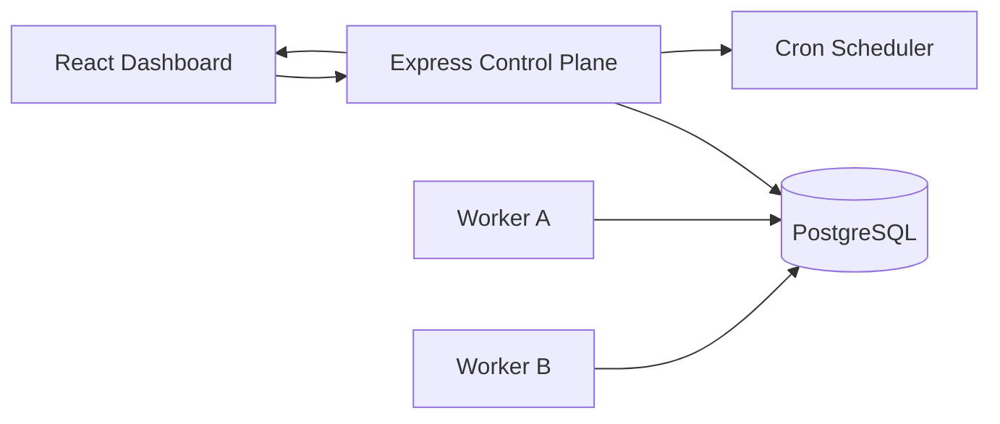
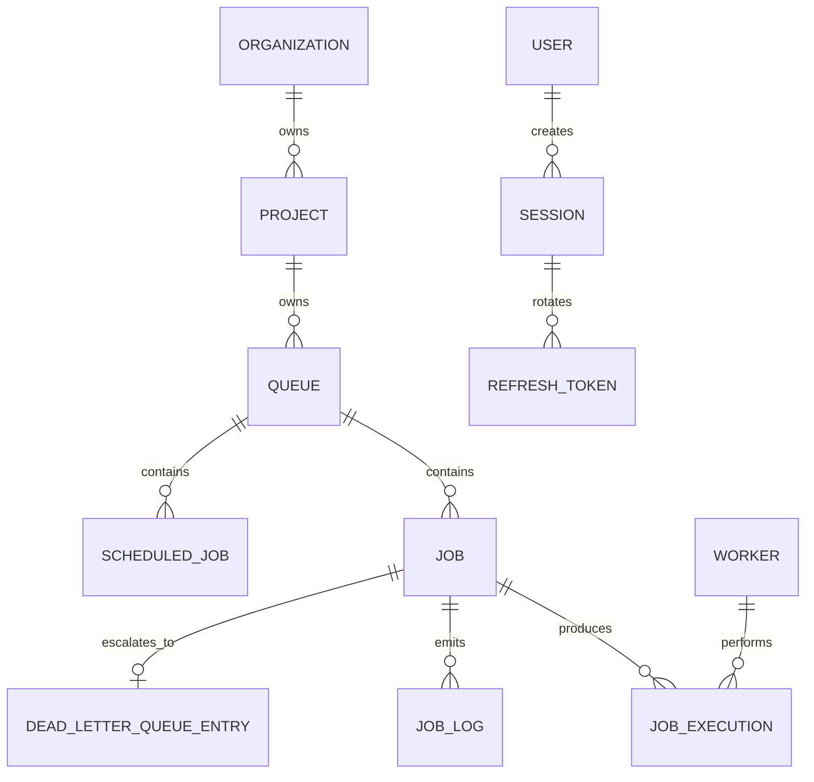
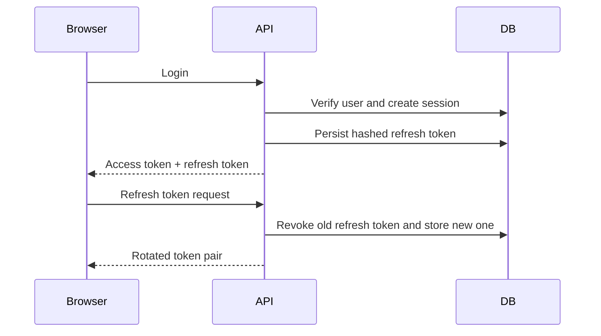

# Distributed Job Scheduler

## Cover Page

**Project:** Distributed Job Scheduler  
**Student Name:** Naman Mahajan  
**Registration Number:** RA2311003011711  
**Repository:** https://github.com/namanmahajan2020/Distributed-Job-Scheduler

---

## Certificate Page

This is to certify that the project titled **Distributed Job Scheduler** has been prepared as part of the academic submission requirements by **Naman Mahajan (RA2311003011711)**. The work presented reflects design, implementation, documentation, testing, and deployment planning for a production-inspired distributed background job execution platform.

---

## Acknowledgement

I would like to acknowledge the guidance provided through the assignment brief, the open-source ecosystem that enabled rapid experimentation, and the engineering communities behind PostgreSQL, Node.js, React, Prisma, Jest, and Docker. Their tooling and documentation made it possible to design, implement, and refine a system that goes beyond a CRUD application and instead demonstrates real distributed systems concerns such as concurrency, retries, fault tolerance, and observability.

---

## Abstract

The Distributed Job Scheduler project is a production-oriented platform for creating, scheduling, executing, retrying, monitoring, and operating asynchronous background jobs across multiple workers. The system is designed as a modular monorepo with an Express-based API, a dedicated worker runtime, PostgreSQL persistence through Prisma ORM, and a React dashboard for operations. Unlike a simple task list or CRUD service, the scheduler addresses real backend concerns such as atomic work claiming, queue-level concurrency control, rate limiting, session-based authentication, retry backoff strategies, dead-letter escalation, worker heartbeats, and graceful shutdown behavior. The dashboard surfaces live worker and queue health using Socket.IO and metrics aggregation. This report explains the problem domain, design decisions, implementation details, database model, API design, testing strategy, deployment setup, and future roadmap.

---

## Table Of Contents

1. Introduction
2. Problem Statement
3. Objectives
4. Existing System
5. Proposed System
6. Functional Requirements
7. Non-Functional Requirements
8. Technology Stack
9. System Architecture
10. High Level Design
11. Low Level Design
12. Database Design
13. ER Diagram
14. API Design
15. Authentication Flow
16. Queue Management
17. Worker Architecture
18. Job Lifecycle
19. Retry Strategies
20. Dead Letter Queue
21. Scheduler
22. Dashboard
23. Real-Time Updates
24. Security Features
25. Logging
26. Error Handling
27. Testing
28. Docker Deployment
29. Performance Optimizations
30. Scalability
31. Future Enhancements
32. Challenges Faced
33. Design Decisions
34. Conclusion
35. References
36. GitHub Repository Link

---

## Introduction

Modern software systems increasingly depend on background processing for workflows that should not block user-facing requests. Examples include payment reconciliation, email delivery, data exports, webhook dispatch, search indexing, media processing, and billing tasks. These operations require robust job orchestration, especially when multiple workers execute in parallel and failures must be retried in a predictable way. The Distributed Job Scheduler project addresses this need by creating a structured platform for background execution that combines durability, operational visibility, and automation.

The project is intentionally engineered as a control plane and execution plane rather than as a monolithic CRUD service. The API owns state transitions, scheduling, security, and observability. Workers claim and execute jobs from shared database state. The dashboard gives operators visibility into the system lifecycle.

---

## Problem Statement

Traditional synchronous systems struggle when long-running or failure-prone tasks are performed inline with client requests. This leads to slow response times, poor failure isolation, and limited scalability. Ad hoc background scripts often lack retry handling, worker coordination, live observability, and secure administration. The problem, therefore, is to create a reliable distributed system capable of:

- storing and scheduling jobs durably
- assigning jobs safely across multiple workers
- recovering from worker failure
- preventing duplicate execution
- retrying jobs with configurable backoff
- surfacing queue and worker health to operators

---

## Objectives

- build a scalable distributed scheduler using production-style architecture
- implement multiple job types including immediate, delayed, scheduled, recurring, and batch
- support queue management controls and retry policies
- secure the platform with JWT and RBAC
- add worker monitoring, logs, and failure handling
- expose the system through REST APIs and a live dashboard
- document the design thoroughly for evaluation and future maintenance

---

## Existing System

Typical simplistic job systems rely on in-memory queues, custom scripts, or unmanaged cron jobs. These approaches often have major limitations:

- loss of job state on process restart
- no durable audit trail
- no operator-facing dashboard
- no worker heartbeat tracking
- no dead-letter queue
- no structured retry policies
- little or no authorization

These issues make them unsuitable for systems that require high reliability or operational accountability.

---

## Proposed System

The proposed system is a distributed, database-backed scheduler with a dedicated control plane and worker runtime. Jobs are persisted in PostgreSQL, claimed atomically, executed with retry awareness, and surfaced in a React dashboard. The system introduces:

- durable queue and job state
- multi-tenant project ownership
- retry and DLQ support
- real-time operational monitoring
- worker shutdown and stale-claim recovery
- strong validation and access control

---

## Functional Requirements

- user registration and login
- refresh token rotation and logout
- organization, membership, and project management
- queue creation, update, pause, resume, and archive
- job creation and listing
- batch job ingestion
- recurring schedule creation and management
- job retry and cancel actions
- worker registration and heartbeat tracking
- metrics and logs retrieval
- live operational updates via Socket.IO

---

## Non-Functional Requirements

- reliability through durable persistence
- maintainability through modular code organization
- observability via structured logging and metrics
- security via RBAC, JWT, and validated inputs
- scalability through decoupled API and worker processes
- fault tolerance through stale-worker detection and DLQ fallback

---

## Technology Stack

### Frontend

- React
- TypeScript
- Vite
- Tailwind CSS
- React Router
- TanStack Query
- Axios
- Chart.js

### Backend

- Node.js
- Express
- TypeScript
- Zod
- Prisma
- PostgreSQL
- Socket.IO
- node-cron
- Pino

### Testing And Operations

- Jest
- Supertest
- Docker
- Docker Compose

---

## System Architecture

The architecture intentionally separates operational control from job execution. This reduces coupling and lets workers scale independently from the dashboard and API.

---

## High Level Design

At a high level, the system is split into four layers:

1. Presentation layer through the dashboard and REST APIs
2. Application layer through route handlers, service orchestration, and validation
3. Domain and persistence layer through Prisma models and PostgreSQL transactions
4. Execution layer through worker processes

The API creates and manages jobs while workers focus exclusively on claiming and executing them. Real-time updates are derived from operational snapshots and event emission.

---

## Low Level Design

The API codebase is structured around routes, middlewares, services, config, and library helpers. Validation happens before service execution. Authentication middleware resolves the current user and session. Resource-specific authorization checks project, queue, and job ownership paths. Services encapsulate business rules such as retry scheduling, DLQ transition, recurring job materialization, and metrics aggregation.

The worker runtime follows a poll loop. On each cycle it:

1. emits a heartbeat
2. claims jobs atomically
3. marks claimed jobs as running
4. executes handlers with timeout protection
5. persists success, retry, or DLQ state

---

## Database Design

The Prisma schema models the following core entities:

- `User`
- `Organization`
- `OrganizationMember`
- `OrganizationInvite`
- `Project`
- `Queue`
- `RetryPolicy`
- `ScheduledJob`
- `Job`
- `JobExecution`
- `Worker`
- `WorkerHeartbeat`
- `JobLog`
- `DeadLetterQueueEntry`
- `Session`
- `RefreshToken`

The schema uses explicit foreign keys, unique constraints, and indexes on hot query paths such as job status, scheduled time, queue ownership, and worker status.

---

## ER Diagram

---

## API Design

The REST API is resource-oriented and grouped into:

- auth endpoints
- organization and project endpoints
- queue management endpoints
- job management endpoints
- recurring schedule endpoints
- worker and metrics endpoints

The API uses:

- Zod validation
- consistent JSON responses
- structured error envelopes
- JWT bearer authentication
- OpenAPI exposure

Detailed endpoint documentation is available in [docs/api.md](./docs/api.md).

---

## Authentication Flow

The authentication system uses short-lived access tokens and rotating refresh tokens. Session rows in the database allow logout to revoke all related refresh tokens. This design balances stateless API authorization with stateful session invalidation.

---

## Queue Management

Queues act as isolation boundaries for job behavior. Each queue can define:

- concurrency limit
- max worker budget
- retry strategy
- pause state
- rate limit per minute
- archival lifecycle

These settings make queues the primary configuration unit for workload behavior.

---

## Worker Architecture

The worker service is designed as a separate process that communicates through PostgreSQL. This means the system does not depend on in-memory coordination or inter-process locks. The worker:

- registers itself on startup
- emits periodic heartbeats
- claims jobs with row locking semantics
- executes work with timeout guards
- marks itself stopping on shutdown
- requeues claimed jobs if needed

This approach improves observability and makes horizontal scale more practical.

---

## Job Lifecycle

Jobs move through the following lifecycle states:

- `QUEUED`
- `SCHEDULED`
- `CLAIMED`
- `RUNNING`
- `COMPLETED`
- `FAILED`
- `RETRYING`
- `DEAD_LETTER`
- `CANCELLED`
- `EXPIRED`

The lifecycle is modeled in both the primary `Job` record and the append-only-ish `JobExecution` and `JobLog` tables.

---

## Retry Strategies

The scheduler supports:

- fixed retry delay
- linear backoff
- exponential backoff

The retry decision is determined by queue policy and per-job retry caps. Once limits are exceeded, the job transitions to the dead-letter queue.

---

## Dead Letter Queue

The DLQ preserves failed jobs that should no longer be retried automatically. This gives operators:

- visibility into terminal failures
- a durable reason field
- the ability to retry manually after inspection

This pattern is critical in production systems because it separates transient instability from persistent business or data errors.

---

## Scheduler

The control plane runs scheduled loops for:

- promoting due jobs
- recovering stale claims
- evaluating recurring schedules
- marking stale workers
- emitting operational snapshots

By keeping scheduling logic in a dedicated control-plane component, job execution remains isolated in workers while orchestration decisions stay centralized.

---

## Dashboard

The React dashboard offers:

- secure login
- overview metrics
- queue status cards
- job explorer with actions
- worker health monitoring
- live refresh through Socket.IO

The dashboard is intentionally operations-focused rather than purely administrative.

---

## Real-Time Updates

Socket.IO is used to push:

- queue updates
- job updates
- worker updates
- log events
- aggregated snapshots

This allows the UI to invalidate stale data and render near-live operations without requiring manual refresh.

---

## Security Features

- bcrypt password hashing
- JWT validation
- refresh token rotation
- session revocation on logout
- RBAC authorization middlewares
- Helmet HTTP hardening
- CORS control
- rate limiting
- request id propagation in errors

---

## Logging

Pino is used for structured application logging. Job-level observability is also persisted through `JobLog` rows. This creates two complementary audit channels:

- operational runtime logs
- job-specific historical logs stored in the database

---

## Error Handling

The API uses a centralized error middleware to normalize:

- business rule errors
- Prisma constraint errors
- generic uncaught exceptions

Each error response contains a request id to support debugging and correlation.

---

## Testing

The API test suite uses Jest and Supertest. Current validated areas include:

- auth library helpers
- middleware branches
- route wiring
- app-level HTTP surface
- selected service behavior

The configured backend coverage target exceeds 80% across the tested API surface.

---

## Docker Deployment

Docker Compose provides a local multi-service runtime containing:

- PostgreSQL
- API
- worker
- web dashboard

This setup enables near-production local verification while keeping onboarding simple.

---

## Performance Optimizations

- indexed queue and job queries
- atomic SQL claim path for worker polling
- pagination on list endpoints
- rate-limited queue execution support
- worker-local concurrency enforcement
- periodic snapshot push instead of excessive per-event fanout

---

## Scalability

The current architecture scales in several useful directions:

- additional workers can be added horizontally
- queues can isolate workloads and policies
- the dashboard and API can later use a websocket adapter for multi-instance broadcast
- PostgreSQL remains the durable coordination point

Further scale enhancements could include queue partitioning, Redis-backed Socket.IO fanout, and pluggable handler registries.

---

## Future Enhancements

- committed Prisma migration history
- CI workflow with Dockerized integration tests
- workflow dependency graphs
- notification hooks
- Redis-based horizontal realtime adapter
- fine-grained per-queue worker allocation

---

## Challenges Faced

- balancing durability with implementation complexity
- preserving simple development ergonomics while modeling realistic distributed concerns
- keeping authorization explicit across multiple resource ownership layers
- ensuring documentation quality matched the intended engineering depth
- improving test coverage without replacing the existing codebase

---

## Design Decisions

### Why PostgreSQL For Coordination

Using PostgreSQL for durable queue state keeps correctness close to the source of truth and allows SQL-level atomic claiming semantics.

### Why Separate API And Worker

Execution concerns differ significantly from management concerns. Separate processes allow cleaner scale and simpler failure isolation.

### Why Queue-Level Retry Policy

Retries are often operational decisions rather than purely code-level decisions. Queue-scoped policy makes this configurable without changing handlers.

### Why Socket.IO Snapshots

The dashboard needs live visibility, but workers should not depend directly on websocket infrastructure. Aggregated snapshots provide useful operational updates with low coupling.

---

## Conclusion

The Distributed Job Scheduler demonstrates how a backend engineering assignment can be implemented as a realistic distributed control plane rather than a basic CRUD application. The project includes authenticated multi-tenant management, queue orchestration, background execution, retry handling, dead-letter escalation, worker liveness tracking, and a live dashboard. While there are still delivery-focused improvements such as committed migration history and fuller end-to-end container verification, the system presents a strong production-inspired foundation and documents its design clearly.

---

## References

- Node.js Documentation
- Express Documentation
- Prisma Documentation
- PostgreSQL Documentation
- React Documentation
- Docker Documentation
- Jest Documentation
- Socket.IO Documentation

---

## GitHub Repository Link

https://github.com/namanmahajan2020/Distributed-Job-Scheduler
