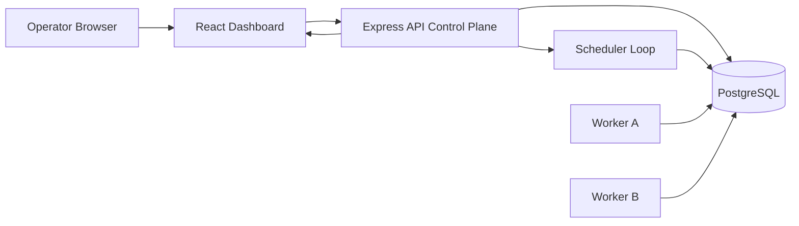

# Distributed Job Scheduler

[](https://nodejs.org/)
[](https://www.typescriptlang.org/)
[](https://react.dev/)
[](https://expressjs.com/)
[](https://www.postgresql.org/)
[](https://www.prisma.io/)
[](https://socket.io/)
[](https://www.docker.com/)
[](./LICENSE)
[](./apps/api/jest.config.js)

Production-inspired distributed job scheduler built as a TypeScript monorepo with an Express control plane, PostgreSQL durability, Prisma ORM, a dedicated worker runtime, and a React operations dashboard.

## Project Overview

This repository models a realistic asynchronous job orchestration platform rather than a basic CRUD application. It focuses on:

- durable queue and job state
- distributed worker coordination
- retry and dead-letter handling
- queue-level concurrency and rate controls
- authenticated multi-tenant operations
- live visibility into jobs, queues, workers, and metrics

## Table Of Contents

1. [Features](#features)
2. [Architecture](#architecture)
3. [Tech Stack](#tech-stack)
4. [Repository Layout](#repository-layout)
5. [Quick Start](#quick-start)
6. [Local Development](#local-development)
7. [Docker Setup](#docker-setup)
8. [Environment Variables](#environment-variables)
9. [Core Flows](#core-flows)
10. [API Documentation](#api-documentation)
11. [Testing](#testing)
12. [Performance](#performance)
13. [Security](#security)
14. [Deployment](#deployment)
15. [Roadmap](#roadmap)
16. [Documentation Index](#documentation-index)
17. [Contributing](#contributing)
18. [License](#license)
19. [Author](#author)

## Features

- JWT authentication with refresh token rotation and session persistence
- RBAC with `ADMIN`, `MEMBER`, and `VIEWER` roles
- organizations, projects, queues, jobs, workers, and recurring schedules
- immediate, delayed, scheduled, recurring, and batch job support
- fixed, linear, and exponential retry strategies
- dead-letter queue recovery path
- atomic job claiming with PostgreSQL row-lock semantics
- worker heartbeats, stale-worker detection, and graceful shutdown requeueing
- real-time dashboard updates via Socket.IO
- Swagger UI and OpenAPI JSON exposure
- Jest and Supertest backend verification with strong API-surface coverage

## Architecture

The system is split into clear runtime boundaries:

- `apps/api`
  The control plane. Owns authentication, queue management, orchestration, metrics, realtime broadcasting, and OpenAPI docs.
- `apps/worker`
  The execution plane. Polls eligible jobs, claims them atomically, executes handlers, records results, and handles retries or DLQ transitions.
- `apps/web`
  The operations UI. Authenticates against the API and provides dashboard views for metrics, queues, jobs, and workers.
- `packages/shared`
  Shared Zod validation contracts used across the monorepo.
- `prisma`
  The relational schema and future migration history.

### Live Architecture Diagram



## Tech Stack

| Layer | Technologies |
| --- | --- |
| Frontend | React, TypeScript, Vite, Tailwind CSS, TanStack Query, Axios, Chart.js, Socket.IO Client |
| Backend | Node.js, Express, TypeScript, Prisma, PostgreSQL, Zod, JWT, bcrypt, Pino, node-cron, Socket.IO |
| Tooling | Docker, Docker Compose, Jest, Supertest |

## Repository Layout

```text
.
|- apps
|  |- api
|  |  |- src
|  |  `- tests
|  |- web
|  |  `- src
|  `- worker
|     `- src
|- docs
|  |- screenshots
|  |- api.md
|  |- architecture.md
|  |- audit-checklist.md
|  |- authentication-flow.md
|  |- deployment-diagram.md
|  |- deployment.md
|  |- design-decisions.md
|  |- er-diagram.md
|  |- folder-structure.md
|  |- queue-flow.md
|  |- retry-flow.md
|  |- sequence-diagram.md
|  `- worker-flow.md
|- packages
|  `- shared
|- prisma
|  `- schema.prisma
|- docker-compose.yml
|- README.md
`- RA2311003011711.md
```

More visual references:

- [Architecture Notes](./docs/architecture.md)
- [Folder Structure Diagram](./docs/folder-structure.md)
- [Design Decisions](./docs/design-decisions.md)
- [Audit Checklist](./docs/audit-checklist.md)

## Quick Start

```bash
npm install
npm run prisma:generate
npm run prisma:migrate
npm run seed
npm run dev:api
npm run dev:worker
npm run dev:web
```

Default seeded credentials:

- `admin@scheduler.local` / `Password123!`
- `member@scheduler.local` / `Password123!`

## Local Development

1. Copy `.env.example` to `.env`.
2. Start PostgreSQL locally or with Docker Compose.
3. Generate Prisma client.
4. Apply schema changes.
5. Seed sample data.
6. Start the API, worker, and web processes.

```bash
npm install
npm run prisma:generate
npm run prisma:migrate
npm run seed
npm run dev:api
npm run dev:worker
npm run dev:web
```

### Application URLs

- API: `http://localhost:4000`
- Swagger UI: `http://localhost:4000/api/docs`
- OpenAPI JSON: `http://localhost:4000/api/openapi.json`
- Dashboard: `http://localhost:5173`

## Docker Setup

The repository includes a development-oriented Compose stack for PostgreSQL, the API, workers, and the dashboard.

### Bring Up The Stack

```bash
docker compose up --build
```

### Recommended Development Flow

```bash
docker compose up -d postgres
npm run prisma:generate
npm run prisma:migrate
npm run seed
docker compose up --build api worker web
```

Related docs:

- [Deployment Guide](./docs/deployment.md)
- [Deployment Diagram](./docs/deployment-diagram.md)

## Environment Variables

| Variable | Purpose |
| --- | --- |
| `NODE_ENV` | Runtime environment |
| `PORT` | API server port |
| `WEB_ORIGIN` | Allowed frontend origin |
| `DATABASE_URL` | PostgreSQL connection string |
| `JWT_ACCESS_SECRET` | Access token signing secret |
| `JWT_REFRESH_SECRET` | Refresh token signing secret |
| `ACCESS_TOKEN_TTL_MINUTES` | Access token lifetime |
| `REFRESH_TOKEN_TTL_DAYS` | Refresh token lifetime |
| `LOG_LEVEL` | Pino logger level |
| `WORKER_POLL_INTERVAL_MS` | Worker polling cadence |
| `WORKER_HEARTBEAT_INTERVAL_MS` | Heartbeat cadence |
| `MAX_JOB_CLAIM_BATCH` | Maximum jobs claimed per poll |
| `RECURRING_SCAN_CRON` | Recurring schedule evaluation cron |
| `SOCKET_SNAPSHOT_INTERVAL_MS` | Dashboard snapshot push interval |
| `WORKER_NAME` | Worker identity |
| `WORKER_CONCURRENCY` | Max concurrent jobs per worker |
| `WORKER_SHUTDOWN_TIMEOUT_MS` | Graceful shutdown wait budget |

Reference:

- [`.env.example`](./.env.example)

## Core Flows

<details>
<summary>Authentication Flow</summary>

- Login issues access and refresh tokens
- Refresh rotates the refresh token and issues a new access token
- Logout revokes the session and refresh-token family

Reference:

- [Authentication Flow](./docs/authentication-flow.md)
</details>

<details>
<summary>Queue And Worker Flow</summary>

- Queues define concurrency, rate, and retry behavior
- Workers poll eligible jobs and claim them atomically
- Claims use PostgreSQL row locking semantics for correctness
- Heartbeats and stale-worker recovery provide operational resilience

References:

- [Queue Flow](./docs/queue-flow.md)
- [Worker Flow](./docs/worker-flow.md)
</details>

<details>
<summary>Retry And DLQ Flow</summary>

- Retry behavior supports fixed, linear, and exponential delay
- Retry exhaustion moves jobs to the dead-letter queue
- Operators can requeue dead-letter items manually

Reference:

- [Retry Flow](./docs/retry-flow.md)
</details>

<details>
<summary>Job Lifecycle</summary>

`QUEUED -> CLAIMED -> RUNNING -> COMPLETED`

and, when required:

`SCHEDULED -> QUEUED`

`RUNNING -> RETRYING -> QUEUED`

`RUNNING -> FAILED -> DEAD_LETTER`

`QUEUED -> CANCELLED`

Reference:

- [Sequence Diagram](./docs/sequence-diagram.md)
</details>

## API Documentation

The API is documented in multiple formats:

- Swagger UI: `http://localhost:4000/api/docs`
- OpenAPI JSON: `http://localhost:4000/api/openapi.json`
- Detailed endpoint guide: [docs/api.md](./docs/api.md)

Key areas:

- auth
- organizations and projects
- queues
- jobs and batch jobs
- recurring jobs
- workers
- metrics

## Testing

Primary verification commands:

```bash
npm test
npm run build
```

The backend test suite covers:

- auth helper behavior
- middleware branches
- route surface coverage through Supertest
- key job-service behavior
- app wiring and documentation exposure

Coverage status:

- configured API-surface coverage exceeds the 80% assignment target for statements, branches, functions, and lines

## Performance

Performance-oriented design choices include:

- atomic claiming with `FOR UPDATE SKIP LOCKED`
- indexed queue and job filters
- paginated list endpoints
- queue-level concurrency and rate controls
- separated API and worker runtimes
- batched realtime snapshots instead of expensive per-row broadcasts

## Security

Implemented security measures:

- bcrypt password hashing
- JWT access tokens
- refresh token rotation
- session-backed revocation
- role-based access control
- Helmet middleware
- CORS controls
- API rate limiting
- Zod request validation
- structured error responses with request ids

## Deployment

The repository is structured for local reproducibility first and production-inspired extension second.

Production notes:

- run API and worker processes as separate deployments
- place PostgreSQL behind managed backup and recovery tooling
- terminate TLS at an ingress or load balancer
- add sticky sessions or a pub/sub adapter when scaling Socket.IO horizontally
- move secrets to a vault or platform secret manager

See:

- [Deployment Guide](./docs/deployment.md)
- [Deployment Diagram](./docs/deployment-diagram.md)

## Roadmap

- commit and version Prisma migrations
- add end-to-end Docker Compose verification
- expand worker and scheduler integration coverage
- add repository screenshots and demo assets
- support richer queue-level analytics and monitoring
- introduce pluggable job handler registration

## Documentation Index

- [Architecture](./docs/architecture.md)
- [API Guide](./docs/api.md)
- [Audit Checklist](./docs/audit-checklist.md)
- [Authentication Flow](./docs/authentication-flow.md)
- [Deployment Guide](./docs/deployment.md)
- [Deployment Diagram](./docs/deployment-diagram.md)
- [Design Decisions](./docs/design-decisions.md)
- [ER Diagram](./docs/er-diagram.md)
- [Folder Structure Diagram](./docs/folder-structure.md)
- [Queue Flow](./docs/queue-flow.md)
- [Retry Flow](./docs/retry-flow.md)
- [Sequence Diagram](./docs/sequence-diagram.md)
- [Worker Flow](./docs/worker-flow.md)
- [Screenshots Placeholder](./docs/screenshots/README.md)
- [Final Report](./RA2311003011711.md)

## Contributing

Contribution guidance is available in [CONTRIBUTING.md](./CONTRIBUTING.md). In short:

- keep changes focused and reviewable
- preserve working behavior
- run `npm test` and `npm run build`
- update docs alongside behavior changes

## License

This repository is available under the [MIT License](./LICENSE).

## Author

- Student: `Naman Mahajan`
- Registration Number: `RA2311003011711`
- Repository: [namanmahajan2020/Distributed-Job-Scheduler](https://github.com/namanmahajan2020/Distributed-Job-Scheduler)

