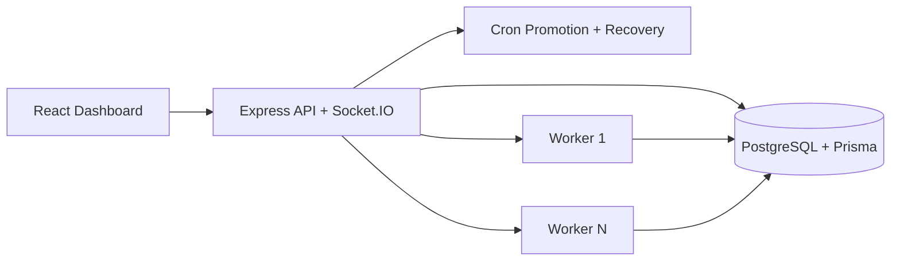

# Architecture

## Execution Flow

1. Clients enqueue jobs through the API.
2. Jobs land in `QUEUED` or `SCHEDULED`.
3. Workers atomically claim eligible jobs with `FOR UPDATE SKIP LOCKED`.
4. Job execution records and logs are persisted per attempt.
5. Failures either reschedule using retry policy or move to DLQ.
