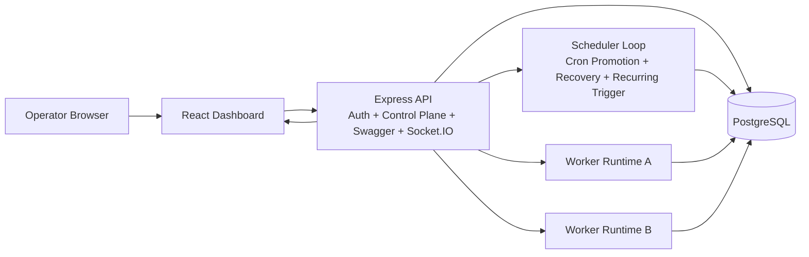

# System Architecture

## Notes

- PostgreSQL is the system of record for queues, jobs, retries, worker liveness, and sessions.
- The API is the control plane and owns security, orchestration, and visibility concerns.
- Workers are horizontally scalable executors that coordinate exclusively through the database.
- Socket.IO is used for operational feedback rather than work distribution.
