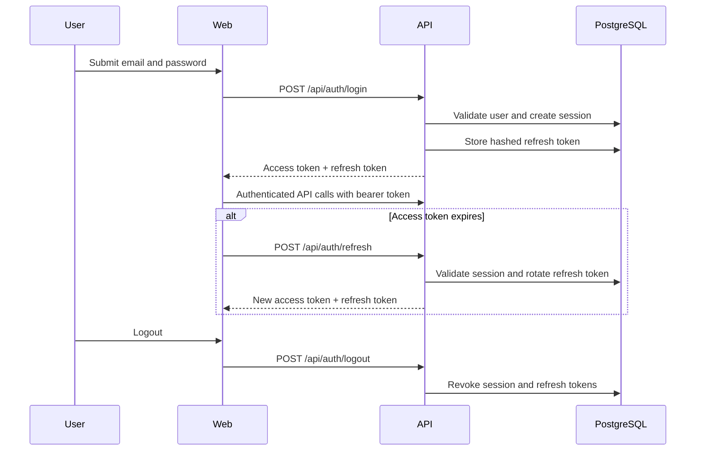

# Authentication Flow

```mermaid
sequenceDiagram
  participant User
  participant Web
  participant API
  participant DB as PostgreSQL

  User->>Web: Submit email and password
  Web->>API: POST /api/auth/login
  API->>DB: Validate user and create session
  API->>DB: Store hashed refresh token
  API-->>Web: Access token + refresh token
  Web->>API: Authenticated API calls with bearer token
  alt Access token expires
    Web->>API: POST /api/auth/refresh
    API->>DB: Validate session and rotate refresh token
    API-->>Web: New access token + refresh token
  end
  User->>Web: Logout
  Web->>API: POST /api/auth/logout
  API->>DB: Revoke session and refresh tokens
```
