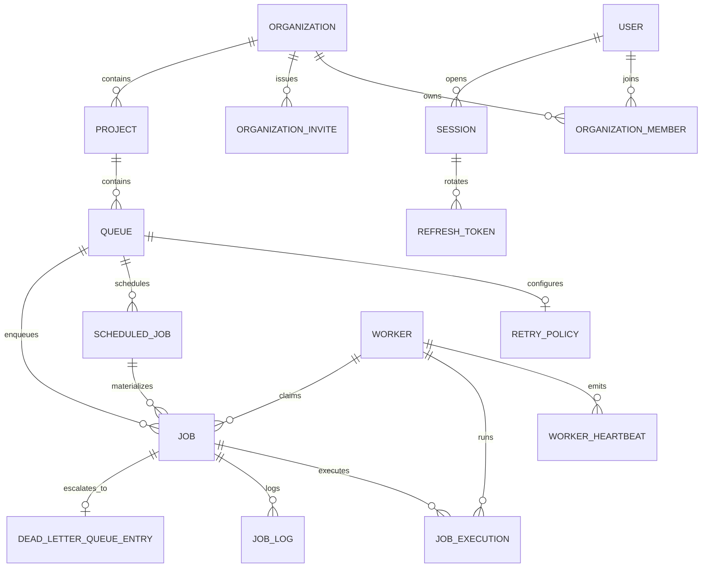

# ER Diagram

## Core Relationships

- organizations own projects and membership boundaries
- projects own queues
- queues own jobs and recurring schedules
- jobs produce execution attempts, logs, and optional DLQ records
- users own sessions and refresh tokens for auth rotation
