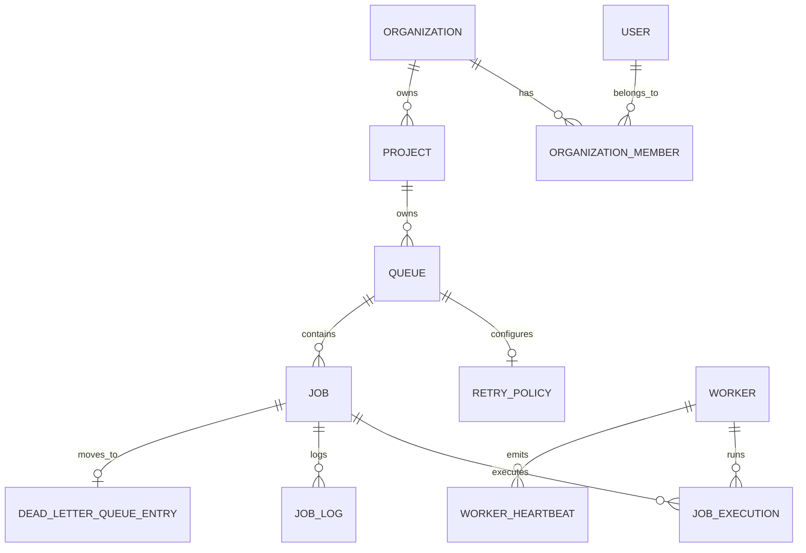

# ER Diagram

```mermaid
erDiagram
  USER ||--o{ ORGANIZATION_MEMBER : belongs_to
  ORGANIZATION ||--o{ ORGANIZATION_MEMBER : has
  ORGANIZATION ||--o{ PROJECT : owns
  PROJECT ||--o{ QUEUE : owns
  QUEUE ||--o| RETRY_POLICY : configures
  QUEUE ||--o{ JOB : contains
  JOB ||--o{ JOB_EXECUTION : executes
  JOB ||--o{ JOB_LOG : logs
  JOB ||--o| DEAD_LETTER_QUEUE_ENTRY : moves_to
  WORKER ||--o{ JOB_EXECUTION : runs
  WORKER ||--o{ WORKER_HEARTBEAT : emits
```
