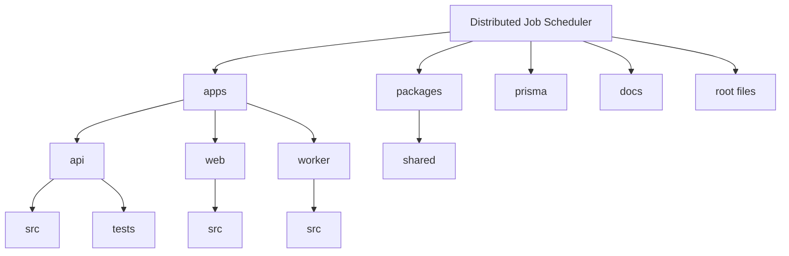

# Folder Structure Diagram

```mermaid
flowchart TD
  Root[Distributed Job Scheduler]
  Root --> Apps[apps]
  Root --> Packages[packages]
  Root --> Prisma[prisma]
  Root --> Docs[docs]
  Root --> RootFiles[root files]
  Apps --> API[api]
  Apps --> Web[web]
  Apps --> Worker[worker]
  API --> APISrc[src]
  API --> APITests[tests]
  Web --> WebSrc[src]
  Worker --> WorkerSrc[src]
  Packages --> Shared[shared]
```
