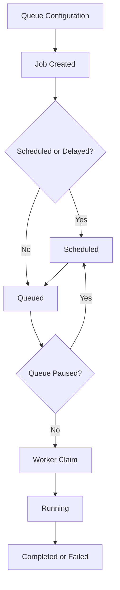

# Queue Flow

```mermaid
flowchart TD
  QueueConfig[Queue Configuration]
  JobCreate[Job Created]
  Scheduled{Scheduled or Delayed?}
  Queued[Queued]
  ScheduledState[Scheduled]
  Paused{Queue Paused?}
  Claim[Worker Claim]
  Running[Running]
  Finished[Completed or Failed]

  QueueConfig --> JobCreate
  JobCreate --> Scheduled
  Scheduled -- Yes --> ScheduledState
  Scheduled -- No --> Queued
  ScheduledState --> Queued
  Queued --> Paused
  Paused -- Yes --> ScheduledState
  Paused -- No --> Claim
  Claim --> Running
  Running --> Finished
```
