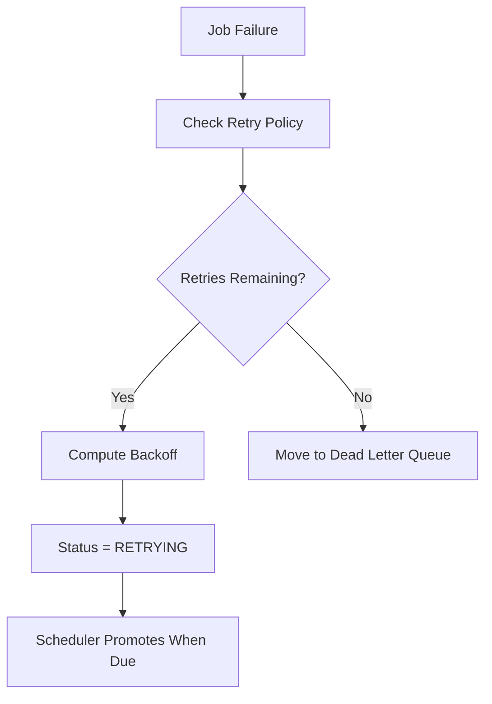

# Retry Flow

```mermaid
flowchart TD
  Failure[Job Failure]
  Check[Check Retry Policy]
  Retryable{Retries Remaining?}
  Backoff[Compute Backoff]
  Retrying[Status = RETRYING]
  Promote[Scheduler Promotes When Due]
  DLQ[Move to Dead Letter Queue]

  Failure --> Check --> Retryable
  Retryable -- Yes --> Backoff --> Retrying --> Promote
  Retryable -- No --> DLQ
```
