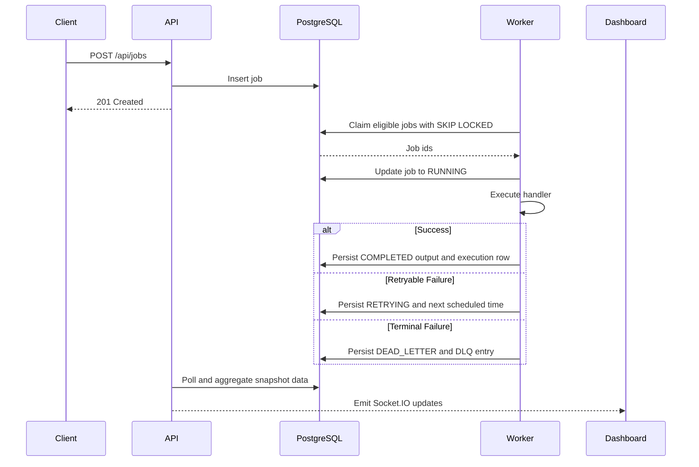

# Job Execution Sequence

```mermaid
sequenceDiagram
  participant Client
  participant API
  participant DB as PostgreSQL
  participant Worker
  participant UI as Dashboard

  Client->>API: POST /api/jobs
  API->>DB: Insert job
  API-->>Client: 201 Created
  Worker->>DB: Claim eligible jobs with SKIP LOCKED
  DB-->>Worker: Job ids
  Worker->>DB: Update job to RUNNING
  Worker->>Worker: Execute handler
  alt Success
    Worker->>DB: Persist COMPLETED output and execution row
  else Retryable Failure
    Worker->>DB: Persist RETRYING and next scheduled time
  else Terminal Failure
    Worker->>DB: Persist DEAD_LETTER and DLQ entry
  end
  API->>DB: Poll and aggregate snapshot data
  API-->>UI: Emit Socket.IO updates
```
