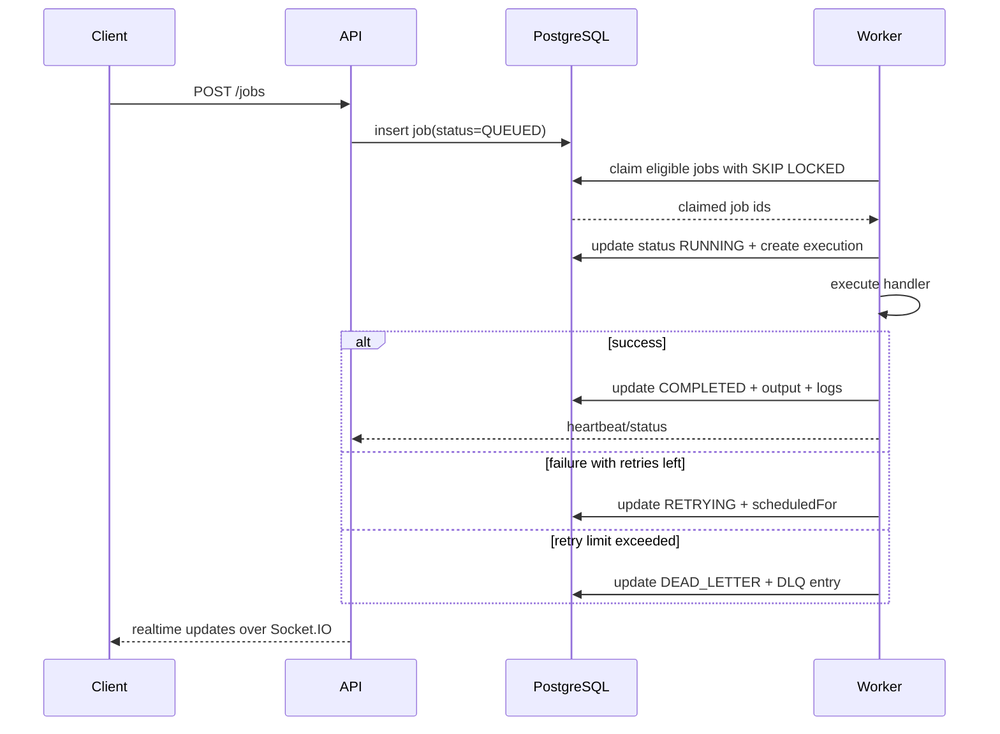

# Sequence Diagram

```mermaid
sequenceDiagram
  participant Client
  participant API
  participant DB as PostgreSQL
  participant Worker

  Client->>API: POST /jobs
  API->>DB: insert job(status=QUEUED)
  Worker->>DB: claim eligible jobs with SKIP LOCKED
  DB-->>Worker: claimed job ids
  Worker->>DB: update status RUNNING + create execution
  Worker->>Worker: execute handler
  alt success
    Worker->>DB: update COMPLETED + output + logs
    Worker-->>API: heartbeat/status
  else failure with retries left
    Worker->>DB: update RETRYING + scheduledFor
  else retry limit exceeded
    Worker->>DB: update DEAD_LETTER + DLQ entry
  end
  API-->>Client: realtime updates over Socket.IO
```
