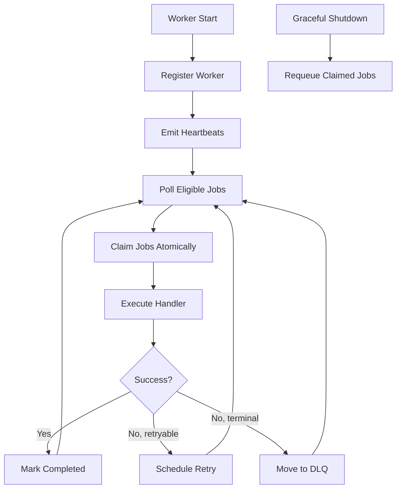

# Worker Flow

```mermaid
flowchart TD
  Start[Worker Start]
  Register[Register Worker]
  Heartbeat[Emit Heartbeats]
  Poll[Poll Eligible Jobs]
  Claim[Claim Jobs Atomically]
  Execute[Execute Handler]
  Success{Success?}
  Retry[Schedule Retry]
  DLQ[Move to DLQ]
  Complete[Mark Completed]
  Shutdown[Graceful Shutdown]
  Requeue[Requeue Claimed Jobs]

  Start --> Register --> Heartbeat --> Poll --> Claim --> Execute
  Execute --> Success
  Success -- Yes --> Complete --> Poll
  Success -- No, retryable --> Retry --> Poll
  Success -- No, terminal --> DLQ --> Poll
  Shutdown --> Requeue
```
